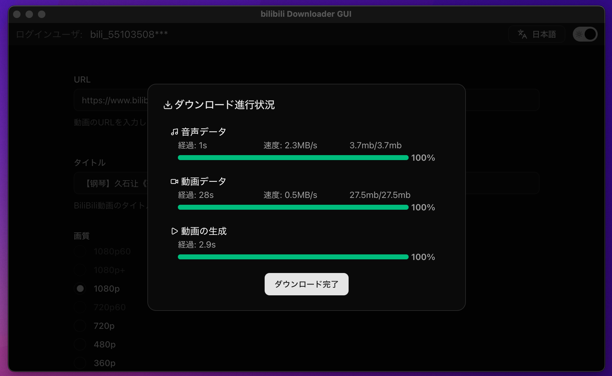

# BILIBILI-DOWNLOADER-GUI

[](LICENSE)


Windows / macOS 対応の Bilibili 動画ダウンローダー GUI。フロントエンドは React + Vite、デスクトップは Tauri（Rust）で実装しています。

> 注意: 本アプリは学術・個人利用を想定しています。各サービスの利用規約・著作権法を遵守し、権利者の許可なくコンテンツをダウンロード・再配布しないでください。




## 主な機能

- Bilibili の動画情報取得とダウンロード補助
- 軽量・高速な Tauri 製デスクトップアプリ
- ダーク/ライトテーマ切り替え（shadcn/ui ベース）
- 進捗表示・トースト通知
- 多言語 UI 対応（英語 / 日本語 / フランス語 / スペイン語 / 中国語 / 韓国語）

## 動作環境

- Node.js 18 以上（推奨 LTS）
- Rust（stable）
- Tauri のビルド前提ツール一式（macOS は Xcode Command Line Tools 等）

参考: [公式サイト（環境準備）](https://tauri.app/)

## 対応 OS

- Windows 10/11
- macOS 12 以降（Intel / Apple Silicon）

## クイックスタート（開発）

1. 依存関係のインストール
   - `npm i`
2. 開発サーバー（Tauri）起動
   - `npm run tauri dev`

## ビルド（配布用バイナリ）

- `npm run tauri build`
  - 成果物は通常、`src-tauri/target/release/`（OSにより異なる）に生成されます。

## インストール

最新版のリリースページからダウンロードしてください：
[Releases › Latest](https://github.com/j4rviscmd/bilibili-downloader-gui/releases/latest)

- Windows (x64)
  - インストーラー（推奨）:
  - EXE: [bilibili-downloader-gui_0.1.0_x64-setup.exe](https://github.com/j4rviscmd/bilibili-downloader-gui/releases/latest/download/bilibili-downloader-gui_0.1.0_x64-setup.exe)
  - MSI（代替）:
  - MSI: [bilibili-downloader-gui_0.1.0_x64_en-US.msi](https://github.com/j4rviscmd/bilibili-downloader-gui/releases/latest/download/bilibili-downloader-gui_0.1.0_x64_en-US.msi)

- macOS（Intel x64 / Apple Silicon aarch64）
  - DMG（Intel x64）: [bilibili-downloader-gui_0.1.0_x64.dmg](https://github.com/j4rviscmd/bilibili-downloader-gui/releases/latest/download/bilibili-downloader-gui_0.1.0_x64.dmg)
  - DMG（Apple Silicon aarch64）: [bilibili-downloader-gui_0.1.0_aarch64.dmg](https://github.com/j4rviscmd/bilibili-downloader-gui/releases/latest/download/bilibili-downloader-gui_0.1.0_aarch64.dmg)
  - アプリ一式（未署名の代替）:
    - TAR.GZ（Intel x64）: [bilibili-downloader-gui_x64.app.tar.gz](https://github.com/j4rviscmd/bilibili-downloader-gui/releases/latest/download/bilibili-downloader-gui_x64.app.tar.gz)
    - TAR.GZ（Apple Silicon aarch64）: [bilibili-downloader-gui_aarch64.app.tar.gz](https://github.com/j4rviscmd/bilibili-downloader-gui/releases/latest/download/bilibili-downloader-gui_aarch64.app.tar.gz)

未署名ビルドの macOS での初回起動手順は、下の Gatekeeper 回避の説明を参照してください。

## macOS で自己署名/未署名ビルドを起動する場合の注意

Apple Developer Program の証明書で署名・公証していないビルドは、Gatekeeper により起動がブロックされることがあります。以下のいずれかで回避できます。

- アプリを右クリック → 開く → 再度「開く」を選ぶ
- もしくは拡張属性（隔離フラグ）を削除する:

```bash
# 実際のインストール先/アプリ名に置き換えてください
xattr -dr com.apple.quarantine "/Applications/bilibili-downloader-gui.app"
# または拡張属性をすべて削除
xattr -c "/Applications/bilibili-downloader-gui.app"
```

アプリを /Applications 以外に配置した場合は、パスを読み替えてください。

## ディレクトリ構成（抜粋）

プロジェクト全体（簡略）:

```plain text
components.json
eslint.config.js
index.html
package.json
vite.config.ts
public/
  icon.png
src/
  App.tsx
  main.tsx
  app/
    store.ts
    contexts/
  components/
    animate-ui/
    ui/
    lib/
  features/
    video/
    init/
    count/
  pages/
  shared/
  styles/
src-tauri/
  Cargo.toml
  tauri.conf.json
  src/
    main.rs
    lib.rs
    handlers/
    models/
    utils/
```

フロントエンド（React + Vite）:

```plain text
/src
  /app                  ← Redux store / React context など
  /components           ← 共通 UI（animate‑ui / shadcn/ui）とプロジェクト共通コンポーネント
  /features             ← ドメイン単位のロジック + 連携 UI（Redux slice, hooks, UI）
  /shared               ← 横断的なロジック/状態（進捗やユーザーなど）
  /pages                ← ルーティングされるページ
  /styles               ← グローバルスタイル
```

バックエンド（Tauri / Rust）:

```plain text
src-tauri/src/
  main.rs            ← エントリポイント（できるだけ薄く）
  lib.rs             ← アプリ本体の root module / コマンド定義
  handlers/          ← 実際の処理（コマンドの実装）
  models/            ← データ構造（リクエスト/レスポンス等）
  utils/             ← 補助ツール
```

（既存 README の開発手順と構成の説明は上記に統合・反映しています）

## スクリプト

- 開発: `npm run tauri dev`
- ビルド: `npm run tauri build`

## 技術スタック

- Frontend: React, Vite, TypeScript, Redux Toolkit, shadcn/ui, animate‑ui
- Desktop: Tauri (Rust)

## エラーコード

フロント側で i18n マッピングされる戻り値コード:

- `ERR::COOKIE_MISSING` Cookie が見つからない / 無効
- `ERR::QUALITY_NOT_FOUND` 指定画質 ID が存在しない
- `ERR::DISK_FULL` 空き容量不足
- `ERR::FILE_EXISTS` 自動リネーム不能なファイル衝突
- `ERR::NETWORK::<detail>` リトライ失敗後のネットワークエラー
- `ERR::MERGE_FAILED` ffmpeg マージ失敗

## 今後の予定（Future）

- [ ] ダウンロード先の指定
- [ ] 既存ファイルの上書き許可
- [ ] `app.log` の出力
- [ ] 複数動画のダウンロードをキューで管理する機能
- [ ] DL履歴保持機能
- [ ] 単一インスタンス起動（多重起動防止）

## ローカライズ (i18n)

現在サポートしている言語:

- 英語 (en)
- 日本語 (ja)
- フランス語 (fr)
- スペイン語 (es)
- 中国語 (zh)
- 韓国語 (ko)

追加の言語や改善提案は歓迎です。不自然 / こなれていない表現を見つけた場合は、遠慮なく Pull Request を送ってください。

If you notice any awkward Japanese/English phrasing, feel free to open a PR.

## 貢献ガイド

Issue / Pull Request 歓迎です。小さな修正（ドキュメント、typo、UI 微調整）も大歓迎。大きな変更は事前に Issue でディスカッションしてください。

## ライセンス

MIT License — 詳細は [LICENSE](./LICENSE) を参照してください。

## 謝辞

- Tauri チームとコミュニティ
- shadcn/ui, Radix UI, sonner などの OSS

---

本プロジェクトがお役に立ちましたら、リポジトリにスターをいただけると継続的な開発の大きな励みになります。
