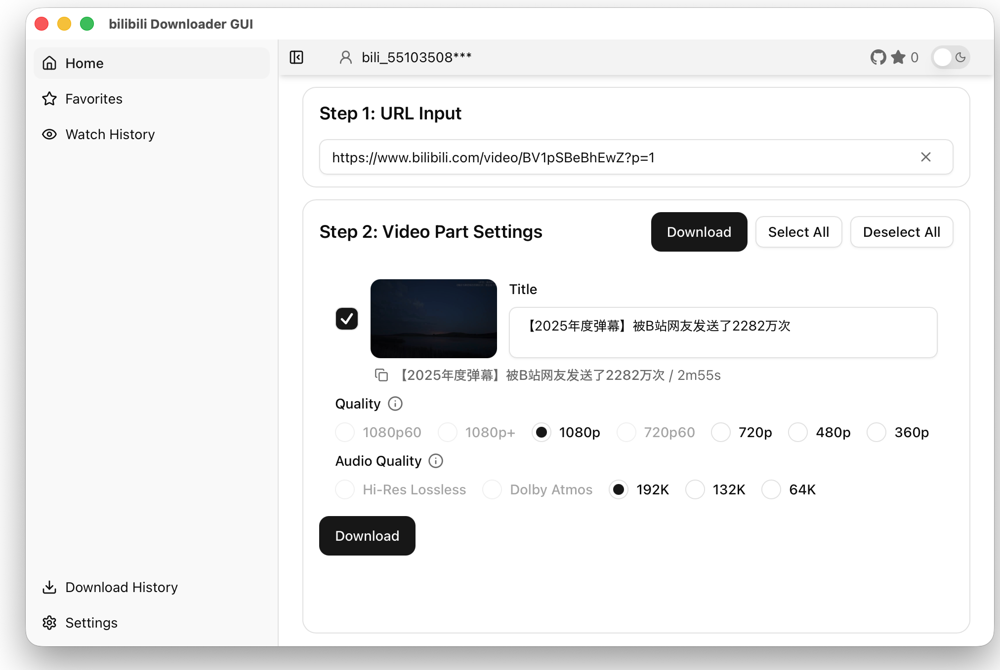
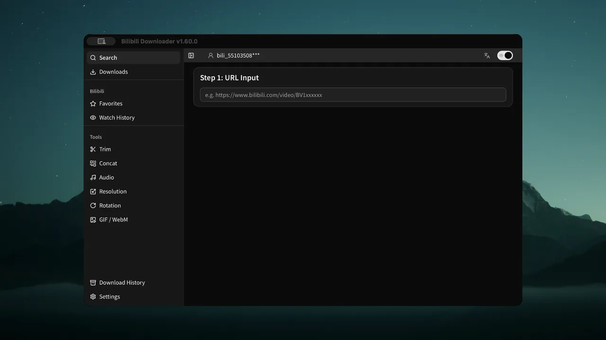

[English](README.md) | [日本語](README.ja.md) | [简体中文](README.zh.md) | [한국어](README.ko.md) | Español | [Français](README.fr.md)

<div align="center">

# Bilibili Downloader GUI

<picture>
  <source media="(prefers-color-scheme: dark)" srcset="./public/app-image(searched)_en.png">
  
</picture>



[](https://github.com/j4rviscmd/bilibili-downloader-gui/releases/latest/download/bilibili-downloader-gui_Windows_x64-setup.exe)
[](https://github.com/j4rviscmd/bilibili-downloader-gui/releases/latest/download/bilibili-downloader-gui_macOS_arm64.dmg)
[](https://github.com/j4rviscmd/bilibili-downloader-gui/releases/latest/download/bilibili-downloader-gui_Linux_x64.deb)
[](https://github.com/j4rviscmd/bilibili-downloader-gui/releases)<br/>
[](https://github.com/j4rviscmd/bilibili-downloader-gui/releases/latest)
[](https://github.com/j4rviscmd/bilibili-downloader-gui/commits/main)
[](https://github.com/j4rviscmd/bilibili-downloader-gui/actions/workflows/ci.yml)
[](https://github.com/j4rviscmd/bilibili-downloader-gui/actions/workflows/codeql.yml)
[](https://coderabbit.ai)
[](https://scorecard.dev/viewer/?uri=github.com/j4rviscmd/bilibili-downloader-gui)
[](https://codecov.io/gh/j4rviscmd/bilibili-downloader-gui)
[](LICENSE)

## Descargador de videos de Bilibili para Windows, macOS y Linux

Sin anuncios, sin seguimiento. 100% gratis.

</div>

## Instalación

### Opción A: Instalador (recomendado)

| Plataforma                | Descarga                                                                                                                                                                     |
| ------------------------- | ---------------------------------------------------------------------------------------------------------------------------------------------------------------------------- |
| **macOS (Apple Silicon)** | [bilibili-downloader-gui_macOS_arm64.dmg](https://github.com/j4rviscmd/bilibili-downloader-gui/releases/latest/download/bilibili-downloader-gui_macOS_arm64.dmg)             |
| **macOS (Intel)**         | [bilibili-downloader-gui_macOS_x64.dmg](https://github.com/j4rviscmd/bilibili-downloader-gui/releases/latest/download/bilibili-downloader-gui_macOS_x64.dmg)                 |
| **Windows**               | [bilibili-downloader-gui_Windows_x64-setup.exe](https://github.com/j4rviscmd/bilibili-downloader-gui/releases/latest/download/bilibili-downloader-gui_Windows_x64-setup.exe) |
| **Linux (deb)**           | [bilibili-downloader-gui_Linux_x64.deb](https://github.com/j4rviscmd/bilibili-downloader-gui/releases/latest/download/bilibili-downloader-gui_Linux_x64.deb)                 |
| **Linux (AppImage)**      | [bilibili-downloader-gui_Linux_x64.AppImage](https://github.com/j4rviscmd/bilibili-downloader-gui/releases/latest/download/bilibili-downloader-gui_Linux_x64.AppImage)       |

> [!NOTE]
> Las compilaciones de macOS usan firma de código ad-hoc (sin notarización de Apple). En el primer inicio, ve a **Configuración del Sistema > Privacidad y Seguridad** y haz clic en **Abrir de todos modos**. Alternativamente, ejecuta:
>
> ```bash
> xattr -dr com.apple.quarantine "/Applications/bilibili-downloader-gui.app"
> ```

> [!NOTE]
> A partir de v1.62.0, las compilaciones de Linux se crean en Ubuntu 24.04 y requieren glibc 2.39 o superior (Debian 13+, Ubuntu 24.04+). En distribuciones más antiguas como Ubuntu 22.04 o Debian 12, v1.62.0 y posteriores no se inician y muestran el error `GLIBC_2.39 not found`; no actualices en esos sistemas.

El instalador de Windows ofrece un selector de idioma. En el primer inicio, elige el idioma predeterminado de la aplicación antes de que comience la configuración de FFmpeg; la selección inicial sigue el idioma de tu sistema/navegador. Puedes cambiarlo en Configuración.

### Opción B: ZIP portátil (solo Windows)

La página de releases también ofrece dos ediciones ZIP portátiles de Windows x64:

- `Windows_x64-light.zip`: descarga más pequeña; instala FFmpeg en el primer inicio.
- `Windows_x64-with-ffmpeg.zip`: incluye FFmpeg, su licencia y los avisos de compilación y código fuente upstream; la configuración de FFmpeg funciona sin descarga de red.

Extrae el ZIP completo antes de ejecutar el programa. Ambas ediciones requieren Microsoft Edge WebView2 Runtime y guardan los ajustes en el directorio de datos de aplicación habitual. El FFmpeg incluido se copia al directorio de biblioteca configurado y sigue disponible tras una actualización de la aplicación.

> [!WARNING]
> Las ediciones ZIP no se actualizan automáticamente. Consulta periódicamente la
> [página de releases](https://github.com/j4rviscmd/bilibili-downloader-gui/releases)
> y actualiza manualmente.

## Características

### Descarga

- **Descarga de video de alta calidad** - Elige cualquier calidad: 8K/4K/1080p/720p/HDR10/Dolby Vision
- **Soporte de Bangumi (anime y series)** - Descarga episodios de anime y series además de videos regulares
- **Guardado por lotes de videos multiparte** - Descarga automáticamente todas las partes de cursos, series, etc.
- **Descargas rápidas y estables** - Cambio automático de CDN con reintento automático ante errores de red
- **Cola de descargas** - Sigue buscando y añadiendo descargas mientras se ejecutan; una cola serial (FIFO) se procesa en la página de descargas con una barra de progreso inferior
- **Incrustación de subtítulos** - Selección de subtítulos blandos/duros con soporte multiidioma y subtítulos con IA
- **Audio de alta resolución** - Compatible con Dolby Atmos y Hi-Res Lossless

### Herramientas locales de MP4

- **Recortar** - Corta archivos MP4 locales por tiempo de inicio/fin (copia sin pérdida o recodificación)
- **Concatenar** - Fusiona varios archivos MP4 en uno (recodificación automática si los códecs no coinciden)
- **Extracción de audio** - Extrae audio de MP4 local a MP3/M4A con presets de bitrate
- **Generador de GIF / WebM** - Convierte un clip MP4 local en un GIF animado (256 colores) o un WebM silencioso con presets de ancho/FPS

### Integración con Bilibili

- **Favoritos** - Explora y descarga videos de tus carpetas de favoritos de Bilibili
- **Historial de visualización** - Descarga videos directamente de tu historial de visualización de Bilibili
- **Expansión automática de URL corta** - Los enlaces cortos de b23.tv se expanden automáticamente a la URL completa del video

### Facilidad de uso

- **Interfaz en 6 idiomas** - Inglés / Japonés / Francés / Español / Chino / Coreano
- **Configuración con un clic** - Instalación automática de FFmpeg con validación de funcionamiento, sin configuración manual
- **Actualización automática** - Actualizador integrado con verificación de versiones firmadas y notas de versión
- **Búsqueda y exportación de historial** - Exporta el historial de descargas a JSON/CSV
- **Soporte de modo oscuro** - Alternancia de tema claro/oscuro

### Métodos de autenticación

- **Detección automática de cookies de Firefox** - Detecta las cookies de Firefox para descargas de alta calidad sin inicio de sesión manual
- **Inicio de sesión con código QR** - Escanea el código QR en la aplicación para iniciar sesión
- **Pegado manual de cookies** - Pega un encabezado `Cookie` copiado de las DevTools de tu navegador; se verifica y guarda igual que una sesión QR
  - Alterna entre Cookie, código QR y inicio de sesión manual en cualquier momento

### Privacidad y seguridad

- **Gestión segura de credenciales** - Las credenciales de inicio de sesión con código QR se cifran con AES-256-GCM y se almacenan localmente. La derivación de claves con Argon2id garantiza protección específica por máquina.
- **Almacenamiento solo local** - Los videos descargados se almacenan solo en tu PC
- **Sin seguimiento** - Utiliza las APIs de Bilibili, GitHub para actualizaciones y los hosts de distribución de FFmpeg para la configuración; sin telemetría

## Contribuir

Issues y PRs son bienvenidos.

Las traducciones también son apreciadas — consulta [CONTRIBUTING.md](./CONTRIBUTING.md) para configuración de desarrollo y guías.

## Agradecimientos

- El equipo y la comunidad de Tauri
- OSS como shadcn/ui, Radix UI, sonner

## Licencia

> [!WARNING]
> Esta aplicación está destinada a uso personal y educativo. Respeta los términos de servicio y las leyes de derechos de autor.<br/>
> No descargues ni redistribuyas contenido sin permiso de los titulares de derechos.<br/>
> Los autores no son responsables de ningún problema que pueda surgir del uso de este software.

MIT License — consulta [LICENSE](./LICENSE) para más detalles.
