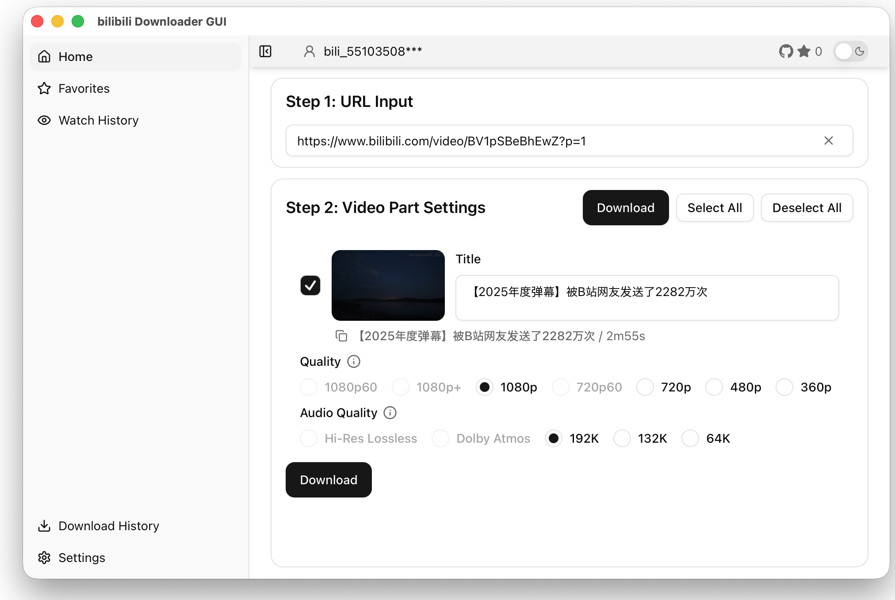

<div align="center">

# Bilibili Downloader GUI

<picture>
  <source media="(prefers-color-scheme: dark)" srcset="./public/app-image(searched)_en.png">
  
</picture>

[English](README.md) | [日本語](README.ja.md) | [简体中文](README.zh.md) | [한국어](README.ko.md) | [Español](README.es.md) | Français

[](https://github.com/j4rviscmd/bilibili-downloader-gui/releases/latest/download/bilibili-downloader-gui_Windows_x64-setup.exe)
[](https://github.com/j4rviscmd/bilibili-downloader-gui/releases/latest/download/bilibili-downloader-gui_macOS_arm64.dmg)
[](https://github.com/j4rviscmd/bilibili-downloader-gui/releases/latest/download/bilibili-downloader-gui_Linux_x64.deb)
[](https://github.com/j4rviscmd/bilibili-downloader-gui/releases)<br/>
[](https://github.com/j4rviscmd/bilibili-downloader-gui/releases/latest)
[](https://github.com/j4rviscmd/bilibili-downloader-gui/commits/main)
[](https://github.com/j4rviscmd/bilibili-downloader-gui/actions/workflows/ci.yml)
[](LICENSE)

## Téléchargeur de vidéos Bilibili pour Windows, macOS et Linux

Pas de publicités, pas de suivi. 100 % gratuit.

</div>

## Fonctionnalités

### Téléchargement

- **Téléchargement vidéo haute qualité** - Choisissez n'importe quelle qualité : 4K/1080p/720p/HDR
- **Prise en charge de Bangumi (anime et séries)** - Téléchargez des épisodes d'anime et de séries en plus des vidéos régulières
- **Sauvegarde par lot de vidéos multi-parties** - Téléchargez automatiquement toutes les parties de cours, séries, etc.
- **Téléchargements rapides et stables** - Changement automatique de CDN avec réessai automatique en cas d'erreurs réseau
- **Traitement en arrière-plan** - Gestion de file avec progression en temps réel
- **Incorporation de sous-titres** - Sélection de sous-titres souples/durs avec support multilingue et sous-titres IA
- **Audio haute résolution** - Prise en charge Dolby Atmos et Hi-Res Lossless

### Outils MP4 locaux

- **Découpage** - Coupez les fichiers MP4 locaux par heure de début/fin (copie de flux sans perte ou réencodage)
- **Concaténation** - Fusionnez plusieurs fichiers MP4 en un seul (réencodage automatique si les codecs ne correspondent pas)
- **Extraction audio** - Extrayez l'audio d'un MP4 local en MP3/M4A avec préréglages de débit

### Intégration Bilibili

- **Favoris** - Parcourez et téléchargez des vidéos depuis vos dossiers de favoris Bilibili
- **Historique de visionnage** - Téléchargez des vidéos directement depuis votre historique de visionnage Bilibili
- **Expansion automatique d'URL courte** - Les liens courts b23.tv s'étendent automatiquement en URL vidéo complète

### Facilité d'utilisation

- **Interface en 6 langues** - Anglais / Japonais / Français / Espagnol / Chinois / Coréen
- **Configuration en un clic** - Installation automatique de FFmpeg avec validation du fonctionnement, sans configuration manuelle
- **Mise à jour automatique** - Metteur à jour intégré avec vérification des versions signées et notes de version
- **Recherche et exportation de l'historique** - Exportez l'historique de téléchargement en JSON/CSV
- **Support du mode sombre** - Basculement thème clair/sombre

### Méthodes d'authentification

- **Détection automatique des cookies Firefox** - Détecte les cookies Firefox pour des téléchargements haute qualité sans connexion manuelle
- **Connexion par code QR** - Scannez le code QR dans l'application pour vous connecter
  - Basculez entre Cookie et connexion QR à tout moment

### Confidentialité et sécurité

- **Gestion sécurisée des identifiants** - Les identifiants de connexion par code QR sont chiffrés avec AES-256-GCM et stockés localement. La dérivation de clés avec Argon2id assure une protection spécifique à la machine.
- **Stockage local uniquement** - Les vidéos téléchargées sont stockées uniquement sur votre PC
- **Aucun suivi** - Ne communique qu'avec les APIs Bilibili et GitHub (pour les mises à jour) ; aucune télémétrie

## Installation

| Plateforme                | Téléchargement                                                                                                                                                                       |
| ------------------------- | ------------------------------------------------------------------------------------------------------------------------------------------------------------------------------------ |
| **macOS (Apple Silicon)** | [bilibili-downloader-gui_macOS_arm64.dmg](https://github.com/j4rviscmd/bilibili-downloader-gui/releases/latest/download/bilibili-downloader-gui_macOS_arm64.dmg)                     |
| **macOS (Intel)**         | [bilibili-downloader-gui_macOS_x64.dmg](https://github.com/j4rviscmd/bilibili-downloader-gui/releases/latest/download/bilibili-downloader-gui_macOS_x64.dmg)                         |
| **Windows**               | [bilibili-downloader-gui_Windows_x64-setup.exe](https://github.com/j4rviscmd/bilibili-downloader-gui/releases/latest/download/bilibili-downloader-gui_Windows_x64-setup.exe)         |
| **Linux (deb)**           | [bilibili-downloader-gui_Linux_x64.deb](https://github.com/j4rviscmd/bilibili-downloader-gui/releases/latest/download/bilibili-downloader-gui_Linux_x64.deb)                         |
| **Linux (AppImage)**      | [bilibili-downloader-gui_Linux_x64.AppImage.tar.gz](https://github.com/j4rviscmd/bilibili-downloader-gui/releases/latest/download/bilibili-downloader-gui_Linux_x64.AppImage.tar.gz) |

> [!NOTE]
> Les builds macOS utilisent la signature de code ad hoc (sans notarisation Apple). Au premier lancement, allez dans **Réglages Système > Confidentialité et sécurité** et cliquez sur **Ouvrir quand même**. Alternativement, exécutez :
>
> ```bash
> xattr -dr com.apple.quarantine "/Applications/bilibili-downloader-gui.app"
> ```

## Contribuer

Les Issues et PR sont les bienvenus.

Les traductions sont également appréciées — consultez [CONTRIBUTING.md](./CONTRIBUTING.md) pour la configuration de développement et les guides.

## Remerciements

- L'équipe et la communauté Tauri
- OSS comme shadcn/ui, Radix UI, sonner

## Licence

> [!WARNING]
> Cette application est destinée à un usage personnel et éducatif. Respectez les conditions d'utilisation et les lois sur le droit d'auteur.<br/>
> Ne téléchargez ni ne redistribuez de contenu sans l'autorisation des détenteurs de droits.<br/>
> Les auteurs ne sont pas responsables des problèmes qui pourraient résulter de l'utilisation de ce logiciel.

MIT License — voir [LICENSE](./LICENSE) pour plus de détails.
