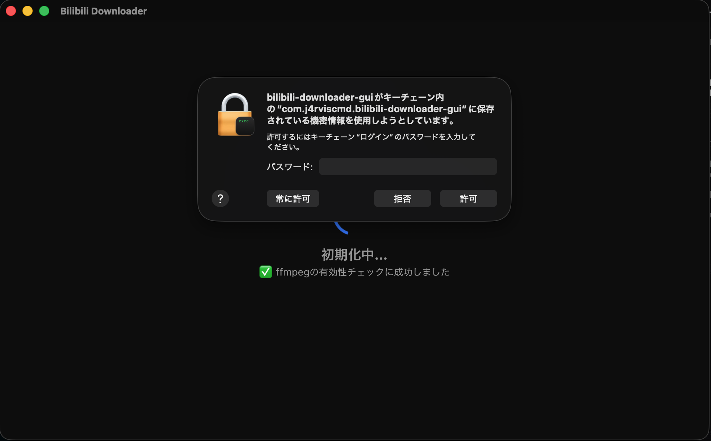

<div align="center">

# Bilibili Downloader GUI

_en_light.png>)

[English](README.md) | [日本語](README.ja.md) | [简体中文](README.zh.md) | 한국어 | [Español](README.es.md) | [Français](README.fr.md)

[](https://github.com/j4rviscmd/bilibili-downloader-gui/releases/latest/download/bilibili-downloader-gui_Windows_x64-setup.exe)
[](https://github.com/j4rviscmd/bilibili-downloader-gui/releases/latest/download/bilibili-downloader-gui_macOS_arm64.dmg)
[](https://github.com/j4rviscmd/bilibili-downloader-gui/releases/latest/download/bilibili-downloader-gui_Linux_x64.deb)
[](https://github.com/j4rviscmd/bilibili-downloader-gui/releases)<br/>
[](https://github.com/j4rviscmd/bilibili-downloader-gui/releases/latest)
[](https://github.com/j4rviscmd/bilibili-downloader-gui/commits/main)
[](https://github.com/j4rviscmd/bilibili-downloader-gui/actions/workflows/ci.yml)
[](LICENSE)

## Windows, macOS 및 Linux Bilibili 동영상 다운로더

광고 없음, 추적 없음. 100% 무료.

</div>

## 기능

### 다운로드

- **고화질 동영상 다운로드** - 4K/1080p/720p/HDR 등 원하는 화질 선택 가능
- **멀티파트 동영상 일괄 저장** - 강좌, 드라마 등 모든 파트 자동 다운로드
- **고속 안정 다운로드** - CDN 자동 전환
- **백그라운드 처리** - 대기열 관리, 실시간 진행률 표시
- **자막 임베드** - 소프트/하드 자막 선택, 다국어 지원
- **하이레즈 오디오** - Dolby Atmos, Hi-Res Lossless 지원

### 사용 편의성

- **6개국어 UI** - 영어 / 일본어 / 프랑스어 / 스페인어 / 중국어 / 한국어
- **원클릭 설정** - FFmpeg 자동 설치, 수동 설정 불필요
- **기록 검색 및 내보내기** - 다운로드 기록을 JSON/CSV로 내보내기
- **다크 모드 지원** - 라이트/다크 테마 전환
- **광고 없는 경험** - 광고 없음, 추적 없음, 완전 무료

### 인증 방법

- **Firefox 쿠키 자동 감지** - Firefox 브라우저의 쿠키를 자동으로 감지하여 수동 로그인 없이 고화질 다운로드 가능
- **QR 코드 로그인** - 앱 내에서 QR 코드를 스캔하여 간편하게 로그인
  - Firefox 쿠키가 감지되지 않은 경우에만 사용 가능

> [!TIP]
> OS 보안 저장소에 접근하기 위해 비밀번호를 요청받는 경우, 입력 후 `항상 허용`을 선택하세요. 이렇게 하면 이후 QR 코드 로그인이 더 원활해집니다.
> 

### 개인정보 보호 및 보안

- **안전한 인증 정보 관리** - QR 코드 로그인 인증 정보는 OS 보안 저장소(macOS: Keychain, Windows: Credential Manager)에서 관리됩니다. 앱은 인증 정보를 저장하지 않습니다.
- **다른 앱 정보에 접근하지 않음** - 보안 저장소 내 다른 애플리케이션의 정보에는 절대 접근하지 않으니 안심하셔도 됩니다.
- **로컬 저장** - 다운로드한 동영상은 사용자 PC에만 저장됩니다.

## 설치

|          플랫폼           |                                                                                       다운로드                                                                                       |
| ------------------------- | ------------------------------------------------------------------------------------------------------------------------------------------------------------------------------------ |
| **macOS (Apple Silicon)** | [bilibili-downloader-gui_macOS_arm64.dmg](https://github.com/j4rviscmd/bilibili-downloader-gui/releases/latest/download/bilibili-downloader-gui_macOS_arm64.dmg)                     |
| **macOS (Intel)**         | [bilibili-downloader-gui_macOS_x64.dmg](https://github.com/j4rviscmd/bilibili-downloader-gui/releases/latest/download/bilibili-downloader-gui_macOS_x64.dmg)                         |
| **Windows**               | [bilibili-downloader-gui_Windows_x64-setup.exe](https://github.com/j4rviscmd/bilibili-downloader-gui/releases/latest/download/bilibili-downloader-gui_Windows_x64-setup.exe)         |
| **Linux (deb)**           | [bilibili-downloader-gui_Linux_x64.deb](https://github.com/j4rviscmd/bilibili-downloader-gui/releases/latest/download/bilibili-downloader-gui_Linux_x64.deb)                         |
| **Linux (AppImage)**      | [bilibili-downloader-gui_Linux_x64.AppImage.tar.gz](https://github.com/j4rviscmd/bilibili-downloader-gui/releases/latest/download/bilibili-downloader-gui_Linux_x64.AppImage.tar.gz) |

> [!NOTE]
> macOS 빌드는 서명되지 않았습니다. 첫 실행 시 다음을 실행하세요:
>
> ```bash
> xattr -dr com.apple.quarantine "/Applications/bilibili-downloader-gui.app"
> ```

## 기여

Issue와 PR을 환영합니다.

번역 기여도 환영합니다 — 개발 환경 설정과 가이드라인은 [CONTRIBUTING.md](./CONTRIBUTING.md)를 참조하세요.

## 감사의 말

- Tauri 팀과 커뮤니티
- shadcn/ui, Radix UI, sonner 등 오픈소스 프로젝트

## 라이선스

> [!WARNING]
> 이 앱은 개인 및 교육 사용 목적으로 제공됩니다. 이용 약관과 저작권법을 준수해 주세요.<br/>
> 저작권자의 허가 없이 콘텐츠를 다운로드하거나 재배포하지 마세요.<br/>
> 본 소프트웨어 사용으로 인해 발생하는 모든 문제에 대해 작성자는 책임지지 않습니다.

MIT License — 자세한 내용은 [LICENSE](./LICENSE)를 참조하세요.
