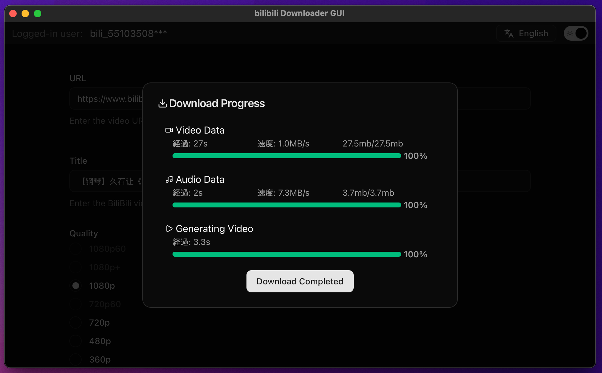

# BILIBILI-DOWNLOADER-GUI

[English](README.md) | [日本語](README.ja.md) | [简体中文](README.zh.md) | [한국어](README.ko.md) | [Español](README.es.md) | [Français](README.fr.md)

[](LICENSE)


<table width="100%">
  <tr>
    <td width="80%">
      <p><strong>Windows 및 macOS용 Bilibili 동영상 다운로더 GUI 애플리케이션</strong></p>
      <p>프론트엔드는 React + Vite로 구축되었으며, 데스크톱 앱은 Tauri(Rust)로 구동됩니다.</p>
    </td>
    <td width="20%">
      
    </td>
  </tr>
</table>

> 참고: 이 앱은 교육 및 개인 사용 목적으로 제공됩니다. 이용 약관과 저작권법을 준수해 주세요. 저작권자의 허가 없이 콘텐츠를 다운로드하거나 재배포하지 마세요.



## ⭐ 이 저장소에 Star를 눌러주세요

여가 시간에 개발하고 있습니다. 모든 Star는 제 작업이 가치 있음을 보여주며 개발을 계속하게 만듭니다!


## 🎯 기능

- Bilibili 동영상 정보 가져오기 및 다운로드 지원
- Tauri로 구축된 가볍고 빠른 데스크톱 앱
- 라이트/다크 테마 전환 (shadcn/ui 기반)
- 진행 표시기 및 토스트 알림
- 다국어 UI (English / 日本語 / Français / Español / 中文 / 한국어)

## 💻 설치

[최신 릴리스](https://github.com/j4rviscmd/bilibili-downloader-gui/releases/latest)에서 다운로드하세요.

### macOS

- **Apple Silicon**: `bilibili-downloader-gui_<version>_aarch64.dmg`
- **Intel x64**: `bilibili-downloader-gui_<version>_x64.dmg`

### Windows

- **설치 프로그램** (권장): `bilibili-downloader-gui_<version>_x64-setup.exe`
- **MSI** (대체): `bilibili-downloader-gui_<version>_x64_en-US.msi`

> **참고**: macOS 빌드는 서명되지 않았습니다. 첫 실행 시, 앱을 우클릭 → 열기 → 열기를 선택하거나, 다음을 실행하세요:
>
> ```bash
> xattr -dr com.apple.quarantine "/Applications/bilibili-downloader-gui.app"
> ```

## 🍎 macOS: 서명되지 않은 빌드의 첫 실행

Apple Developer 인증서로 공증/서명되지 않은 빌드(예: CI 아티팩트)를 실행하면 macOS Gatekeeper가 앱을 차단할 수 있습니다. 다음 방법으로 해결할 수 있습니다:

- 앱을 우클릭 → 열기 → 열기 선택, 또는
- 격리/확장 속성 제거:

```bash
# 경로를 실제 설치된 앱 이름/위치로 변경하세요
xattr -dr com.apple.quarantine "/Applications/bilibili-downloader-gui.app"
# 또는 모든 확장 속성 지우기
xattr -c "/Applications/bilibili-downloader-gui.app"
```

앱을 /Applications 외부에 설치한 경우, 경로를 적절히 조정하세요.

---

## 👨‍💻 개발자를 위한 안내

다음 섹션은 이 프로젝트를 빌드, 수정 또는 기여하려는 개발자를 위한 것입니다.

## 📦 요구 사항

- Node.js 18+ (LTS 권장)
- Rust (stable)
- Tauri 빌드에 필요한 툴체인 (예: macOS의 Xcode Command Line Tools)

참고: [Tauri 공식 문서](https://tauri.app/)

## 💻 지원 OS

- Windows 10/11
- macOS 12+ (Intel 및 Apple Silicon)

## 🚀 빠른 시작 (개발)

1. 의존성 설치
   - `npm i`
2. Tauri 개발 서버 시작
   - `npm run tauri dev`

## 🔨 빌드 (배포용 바이너리)

- `npm run tauri build`
  - 아티팩트는 일반적으로 `src-tauri/target/release/`에 생성됩니다 (OS에 따라 다름).

## 디렉토리 구조 (Co-location)

**기능 기반 공동 배치** 폴더 전략을 사용합니다.

```txt
src/
  ├── app/                      # 애플리케이션 구성
  │   ├── providers/            # 전역 Provider (Theme, Listener)
  │   └── store/                # Redux store 구성
  ├── pages/                    # 라우트 수준 화면
  │   ├── home/
  │   │   └── index.tsx
  │   ├── init/
  │   │   └── index.tsx
  │   └── error/
  │       └── index.tsx
  ├── features/                 # 기능 모듈
  │   ├── video/
  │   │   ├── ui/               # VideoForm1, VideoForm2, DownloadButton 등
  │   │   ├── model/            # videoSlice, inputSlice, selectors
  │   │   ├── hooks/            # useVideoInfo
  │   │   ├── api/              # fetchVideoInfo, downloadVideo
  │   │   ├── lib/              # utils, formSchema, constants
  │   │   ├── types.ts
  │   │   └── index.ts          # Public API
  │   ├── init/
  │   │   ├── model/            # initSlice
  │   │   ├── hooks/            # useInit
  │   │   └── index.ts
  │   ├── settings/
  │   │   ├── ui/               # SettingsDialog, LanguagesDropdown
  │   │   ├── model/            # settingsSlice
  │   │   ├── api/              # settingApi
  │   │   └── index.ts
  │   ├── user/
  │   │   ├── model/            # userSlice
  │   │   ├── hooks/            # useUser
  │   │   ├── api/              # fetchUser
  │   │   └── index.ts
  │   └── preference/
  │       ├── ui/               # ToggleThemeButton
  │       └── index.ts
  ├── shared/                   # 공유 리소스
  │   ├── ui/                   # shadcn/ui 컴포넌트, AppBar, Progress
  │   ├── animate-ui/           # 애니메이션 UI 컴포넌트
  │   ├── hooks/                # useIsMobile 등
  │   ├── lib/                  # cn(), 유틸리티
  │   ├── progress/             # 진행 상태 관리
  │   ├── downloadStatus/       # 다운로드 상태 관리
  │   ├── queue/                # 큐 상태
  │   └── os/                   # OS 감지 API
  ├── i18n/                     # 국제화
  │   └── locales/              # 번역 파일
  ├── styles/                   # 전역 스타일
  └── assets/                   # 정적 자산
```

### 디렉토리 책임

#### `src/app/`

루트 수준의 애플리케이션 구성. 전역 프로바이더와 스토어 설정이 위치합니다.

#### `src/pages/`

라우트 수준 화면. 페이지는 주로 기능과 공유 UI를 **구성**해야 합니다. 비즈니스 로직/상태는 `features/` 내에 유지하세요.

#### `src/features/`

재사용 가능한 제품 기능 (사용자 대면 동작). 각 기능은 Redux 로직, API 호출, UI를 공동 배치합니다.

일반적인 기능 폴더에는 다음이 포함됩니다:

- `ui/` — 기능별 UI 컴포넌트
- `model/` — Redux Toolkit slice, selectors
- `hooks/` — 기능 훅
- `api/` — 기능별 API 함수
- `lib/` — 기능 내부 유틸리티
- `types.ts` — 기능 로컬 타입
- `index.ts` — 기능 **Public API** (권장 가져오기 진입점)

#### `src/shared/`

앱 전체에서 사용되는 재사용 가능한 도메인 비특정 빌딩 블록.

- `shared/ui/` — 앱 전체 재사용 가능 UI 프리미티브 (shadcn/ui, 커스텀 컴포넌트)
- `shared/animate-ui/` — 애니메이션 UI 컴포넌트
- `shared/lib/` — 범용 유틸리티 (예: `cn()`)
- `shared/hooks/` — 재사용 가능한 React hooks

### 가져오기 규칙

- `pages` → `features`, `shared`에서 가져오기 가능
- `features` → `pages`에서 가져오기 금지
- 다른 `features`에서 직접 가져오기 피하기. `pages`에서 구성 권장
- 기능의 `index.ts` (Public API)에서 가져오기 권장 (깊은 경로 피하기)

### 경로 별칭

- `@/app/*`
- `@/pages/*`
- `@/features/*`
- `@/shared/*`

### 백엔드 (Tauri / Rust)

```txt
src-tauri/src/
  main.rs            ← 진입점 (간결하게 유지)
  lib.rs             ← 앱 루트 모듈 / 명령 정의
  handlers/          ← 명령 구현
  models/            ← 데이터 구조 (요청/응답 등)
  utils/             ← 유틸리티
```

## ⚙️ 스크립트

- 개발: `npm run tauri dev`
- 빌드: `npm run tauri build`

## 🛠️ 기술 스택

- 프론트엔드: React, Vite, TypeScript, Redux Toolkit, shadcn/ui, animate‑ui
- 데스크톱: Tauri (Rust)

## ❌ 에러 코드

반환되는 에러 코드 (프론트엔드에서 i18n으로 매핑):

- `ERR::COOKIE_MISSING` Cookie가 없거나 유효하지 않음
- `ERR::QUALITY_NOT_FOUND` 요청한 품질 ID를 사용할 수 없음
- `ERR::DISK_FULL` 디스크 여유 공간 부족
- `ERR::FILE_EXISTS` 파일 충돌을 자동으로 해결할 수 없음
- `ERR::NETWORK::<detail>` 재시도 후 네트워크 실패
- `ERR::MERGE_FAILED` ffmpeg 병합 프로세스 실패

## 🔮 향후 계획

- [ ] 다운로드 대상 선택
- [ ] 기존 파일 덮어쓰기 허용
- [ ] 여러 항목 큐잉 다운로드
- [ ] 다운로드 기록 보존
- [ ] 단일 인스턴스 앱 실행 (여러 동시 실행 방지)

## 🌍 현지화 (i18n)

현재 지원 언어:

- English (en)
- 日本語 (ja)
- Français (fr)
- Español (es)
- 中文 (zh)
- 한국어 (ko)

추가 언어 기여를 환영합니다. 어색하거나 부자연스러운 표현을 발견하시면 Pull Request를 열어주세요.

## 🤝 기여

Issue와 PR을 환영합니다. 큰 변경이 있는 경우, 먼저 Issue에서 논의를 시작해 주세요. 작은 수정(문서, 오타, 사소한 UI 조정)도 감사합니다.

## 📜 라이선스

MIT License — 자세한 내용은 [LICENSE](./LICENSE)를 참조하세요.

## 🙏 감사의 말

- Tauri 팀과 커뮤니티
- shadcn/ui, Radix UI, sonner 등 OSS

---

이 프로젝트가 유용하다고 생각되시면 저장소에 Star를 고려해 주세요 — 지속적인 개발에 큰 동기가 됩니다.
