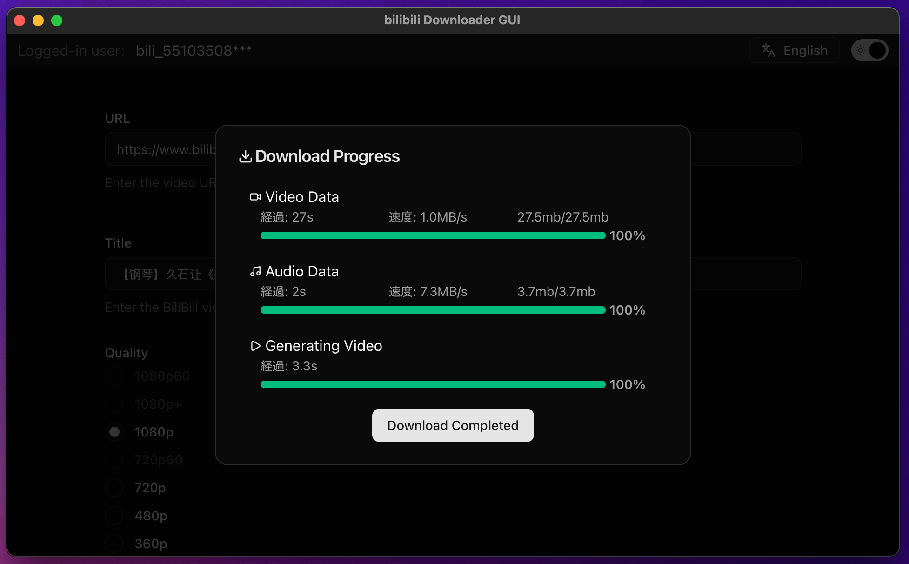

# BILIBILI-DOWNLOADER-GUI

[](LICENSE)


Windows and macOS Bilibili video downloader GUI. Frontend is built with React + Vite; the desktop app is powered by Tauri (Rust).

> Notice: This app is intended for educational and personal use. Respect the terms of service and copyright laws. Do not download or redistribute content without permission from rights holders.




## Features

- Fetch Bilibili video info and assist downloads
- Lightweight and fast desktop app built with Tauri
- Light/Dark theme toggle (shadcn/ui based)
- Progress indicator and toast notifications
- Multi-language UI (English / 日本語 / Français / Español / 中文 / 한국어)

## Requirements

- Node.js 18+ (LTS recommended)
- Rust (stable)
- Toolchain required by Tauri builds (e.g., Xcode Command Line Tools on macOS)

See: [Tauri official docs](https://tauri.app/)

## Supported OS

- Windows 10/11
- macOS 12+ (Intel and Apple Silicon)

## Quick Start (Development)

1. Install dependencies
   - `npm i`
2. Start the Tauri development server
   - `npm run tauri dev`

## Build (Distributable Binaries)

- `npm run tauri build`
  - Artifacts are typically generated under `src-tauri/target/release/` (varies by OS).

## Installation

Download from the latest release: [Releases › Latest](https://github.com/j4rviscmd/bilibili-downloader-gui/releases/latest)

- Windows (x64)
  - Installer (recommended):
  - EXE: [bilibili-downloader-gui_0.1.0_x64-setup.exe](https://github.com/j4rviscmd/bilibili-downloader-gui/releases/latest/download/bilibili-downloader-gui_0.1.0_x64-setup.exe)
  - MSI (alternative):
  - MSI: [bilibili-downloader-gui_0.1.0_x64_en-US.msi](https://github.com/j4rviscmd/bilibili-downloader-gui/releases/latest/download/bilibili-downloader-gui_0.1.0_x64_en-US.msi)

- macOS (Intel x64 and Apple Silicon aarch64)
  - DMG (Intel x64): [bilibili-downloader-gui_0.1.0_x64.dmg](https://github.com/j4rviscmd/bilibili-downloader-gui/releases/latest/download/bilibili-downloader-gui_0.1.0_x64.dmg)
  - DMG (Apple Silicon aarch64): [bilibili-downloader-gui_0.1.0_aarch64.dmg](https://github.com/j4rviscmd/bilibili-downloader-gui/releases/latest/download/bilibili-downloader-gui_0.1.0_aarch64.dmg)
  - App archive (unsigned alternative):
    - TAR.GZ (Intel x64): [bilibili-downloader-gui_x64.app.tar.gz](https://github.com/j4rviscmd/bilibili-downloader-gui/releases/latest/download/bilibili-downloader-gui_x64.app.tar.gz)
    - TAR.GZ (Apple Silicon aarch64): [bilibili-downloader-gui_aarch64.app.tar.gz](https://github.com/j4rviscmd/bilibili-downloader-gui/releases/latest/download/bilibili-downloader-gui_aarch64.app.tar.gz)

Note: For unsigned builds on macOS, see the section below about Gatekeeper and xattr.

## macOS: First Launch of Unsigned Builds

If you run a build that is not notarized/signed with an Apple Developer certificate (e.g., CI artifacts), macOS Gatekeeper may block the app. You can either:

- Right-click the app → Open → Open, or
- Remove the quarantine/extended attributes:

```bash
# Replace the path with your actual installed app name/location
xattr -dr com.apple.quarantine "/Applications/bilibili-downloader-gui.app"
# or clear all extended attributes
xattr -c "/Applications/bilibili-downloader-gui.app"
```

If you installed the app outside /Applications, adjust the path accordingly.

## Project Structure (Excerpt)

Top-level overview:

```plain text
components.json
eslint.config.js
index.html
package.json
vite.config.ts
public/
  icon.png
src/
  App.tsx
  main.tsx
  app/
    store.ts
    contexts/
  components/
    animate-ui/
    ui/
    lib/
  features/
    video/
    init/
    count/
  pages/
  shared/
  styles/
src-tauri/
  Cargo.toml
  tauri.conf.json
  src/
    main.rs
    lib.rs
    handlers/
    models/
    utils/
```

Frontend (React + Vite):

```plain text
/src
  /app                  ← Redux store / React context
  /components           ← Shared UI (animate‑ui / shadcn/ui) and project-level components
  /features             ← Domain logic + connected UI (Redux slices, hooks, UI)
  /shared               ← Cross-cutting logic/state (progress, user, etc.)
  /pages                ← Routed pages
  /styles               ← Global styles
```

Backend (Tauri / Rust):

```plain text
src-tauri/src/
  main.rs            ← Entry point (kept thin)
  lib.rs             ← App root module / command definitions
  handlers/          ← Implementations of commands
  models/            ← Data structures (requests/responses, etc.)
  utils/             ← Utilities
```

(The prior README’s development steps and structure notes are integrated above.)

## Scripts

- Dev: `npm run tauri dev`
- Build: `npm run tauri build`

## Tech Stack

- Frontend: React, Vite, TypeScript, Redux Toolkit, shadcn/ui, animate‑ui
- Desktop: Tauri (Rust)

## Future

- [ ] Select download destination
- [ ] Allow overwriting existing files
- [ ] Queueing multiple items for download
- [ ] Download history retention
- [ ] Single-instance app launch (prevent multiple concurrent launches)

## Localization (i18n)

Current supported languages:

- English (en)
- 日本語 (ja)
- Français (fr)
- Español (es)
- 中文 (zh)
- 한국어 (ko)

Contributions welcome for additional languages. If you find an unnatural or awkward phrase, please open a Pull Request.

不自然な言い回しや表現を見つけた場合は、遠慮なく Pull Request を送ってください。

## Contributing

Issues and PRs are welcome. For large changes, please start a discussion in an Issue first. Small fixes (docs, typos, minor UI tweaks) are appreciated.

## License

MIT License — see [LICENSE](./LICENSE) for details.

## Acknowledgements

- The Tauri team and community
- OSS such as shadcn/ui, Radix UI, sonner

---

If you find this project useful, please consider starring the repo — it really helps motivate continued development.
