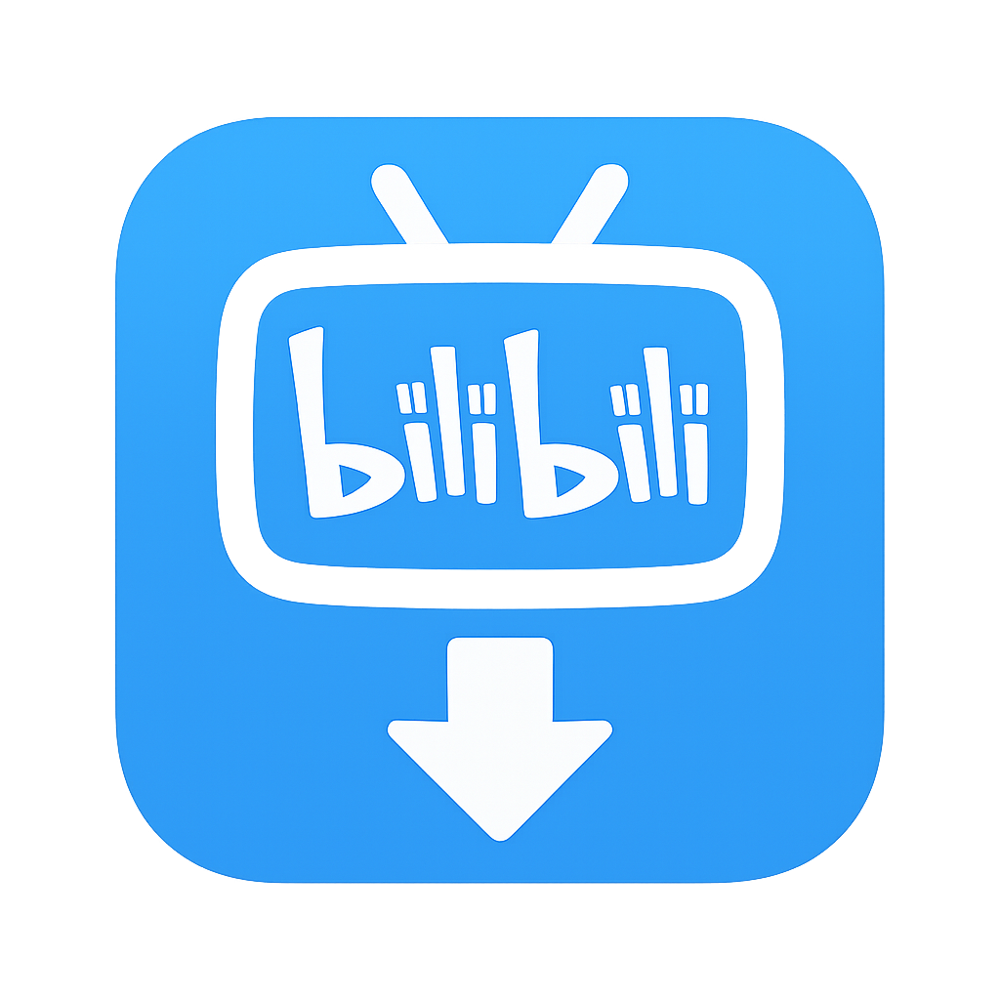

# BILIBILI-DOWNLOADER-GUI

[English](README.md) | [日本語](README.ja.md) | [简体中文](README.zh.md) | [한국어](README.ko.md) | [Español](README.es.md) | [Français](README.fr.md)

[](https://github.com/j4rviscmd/bilibili-downloader-gui/releases/latest)
[](https://github.com/j4rviscmd/bilibili-downloader-gui/releases/latest)

[](https://github.com/j4rviscmd/bilibili-downloader-gui/releases/latest)
[](https://github.com/j4rviscmd/bilibili-downloader-gui/actions/workflows/ci.yml)
[](https://github.com/j4rviscmd/bilibili-downloader-gui/commits/main)
[](LICENSE)

<table width="100%">
  <tr>
    <td width="80%">
      <p><strong>Windows and macOS Bilibili video downloader GUI.</strong></p>
      <p>No configuration needed. Install and start downloading videos right away.</p>
    </td>
    <td width="20%">
      
    </td>
  </tr>
</table>

_en.png>)
_en.png>)

> [!WARNING]
> This app is intended for educational and personal use. Respect the terms of service and copyright laws. Do not download or redistribute content without permission from rights holders.

## Star this repo to keep me motivated ⭐

I build this as a hobby. No stars, I'll shut it down 😄

<div align="center">
  
</div>

## Features

### Download

- **High-quality video download** - Choose any quality from 4K/1080p/720p
- **Multi-part video batch save** - Automatically download all parts of courses, series, etc.
- **Fast & stable downloads** - Auto CDN switching when slow, up to 5 retries
- **Background processing** - Queue management with real-time progress

### Ease of Use

- **6-language UI** - English / 日本語 / Français / Español / 中文 / 한국어
- **One-click setup** - FFmpeg auto-install, no manual configuration needed
- **History search & export** - Export download history to JSON/CSV
- **Dark mode support** - Light/dark theme toggle

### No Login Required & Privacy First

- **Firefox cookie auto-detection** - High-quality downloads without manual login
- **Local-only storage** - All data stored only on your PC

## Installation

Download from the [latest release](https://github.com/j4rviscmd/bilibili-downloader-gui/releases/latest).

### macOS

- **Apple Silicon**: `bilibili-downloader-gui_<version>_aarch64.dmg`
- **Intel x64**: `bilibili-downloader-gui_<version>_x64.dmg`

### Windows

- **Installer** (recommended): `bilibili-downloader-gui_<version>_x64-setup.exe`
- **MSI** (alternative): `bilibili-downloader-gui_<version>_x64_en-US.msi`

> [!NOTE]
> macOS builds are not signed. On first launch, run:
>
> ```bash
> xattr -dr com.apple.quarantine "/Applications/bilibili-downloader-gui.app"
> ```

## Contributing

Issues and PRs are welcome.

Translations are also appreciated — see [CONTRIBUTING.md](./CONTRIBUTING.md) for development setup and guidelines.

## Acknowledgements

- The Tauri team and community
- OSS such as shadcn/ui, Radix UI, sonner

## License

MIT License — see [LICENSE](./LICENSE) for details.
